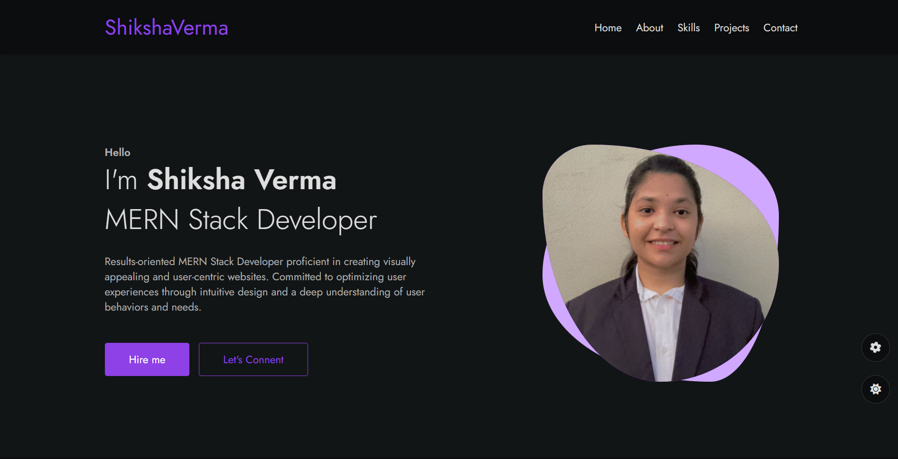

# 🌐 Professional Portfolio Website

## 🔗 Live Demo
[View Portfolio Live](https://portfolio-mu-roan-30.vercel.app/)

## ✨ Features
- 🚀 **Fluid Animations:** Smooth micro-interactions, page transitions, and reveal animations powered by Framer Motion.
- 📱 **100% Responsive Design:** Tailored pixel-perfect layouts optimizing display consistency across mobile, tablet, and desktop viewports.
- ⚡ **High Performance:** Optimized component trees and efficient asset loading to maintain a 95+ Core Web Vitals score.
- 🔍 **SEO Optimized:** Structured semantic markup, clean meta configurations, and index-ready routing layouts.
- 📦 **Component Driven:** Highly modular architecture making it straightforward to scale, add new projects, or swap text blocks.

## 🛠️ Tech Stack
- **Frontend Framework:** React.js
- **Animation Engine:** Framer Motion
- **Styling Architecture:** Tailwind CSS (Utility-first styling grid)
- **Hosting & Deployment:** Vercel Edge Production Environment

## 📸 Screenshots


## 🚀 Quick Start

```bash
# Clone the repository
git clone [https://github.com/ShikshaVerma-28/Portfolio](https://github.com/ShikshaVerma-28/Portfolio)_

# Navigate into the workspace directory
cd Portfolio_

# Install project dependencies
npm install

# Boot up the local development compilation server
npm start
```
📂 Project Structure
├── public/          # Static assets and favicons
├── src/
│   ├── components/  # Reusable UI modules (Navbar, ProjectCard, Button)
│   ├── sections/    # Main page layouts (Hero, About, Projects, Contact)
│   ├── assets/      # Optimised styling graphics and vector icons
│   ├── App.js       # Core root runtime layout wrapper
│   └── index.js     # Entry point execution bundle
